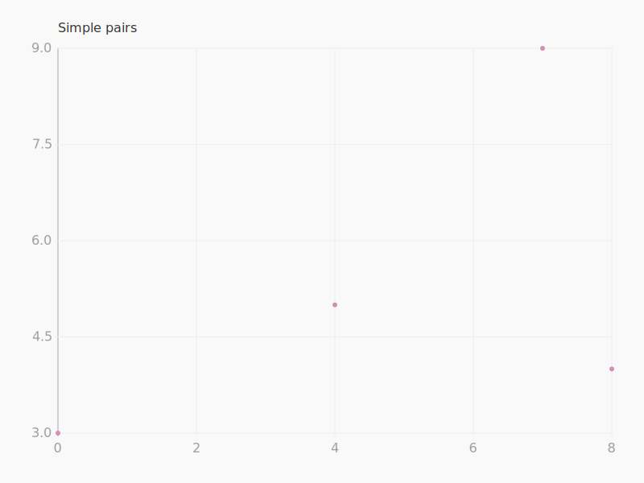
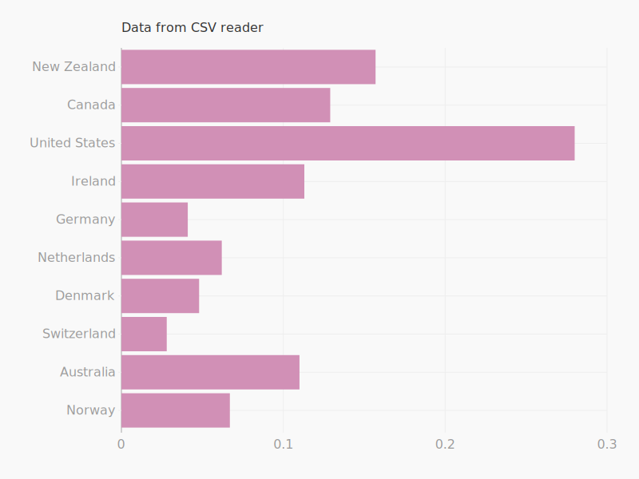
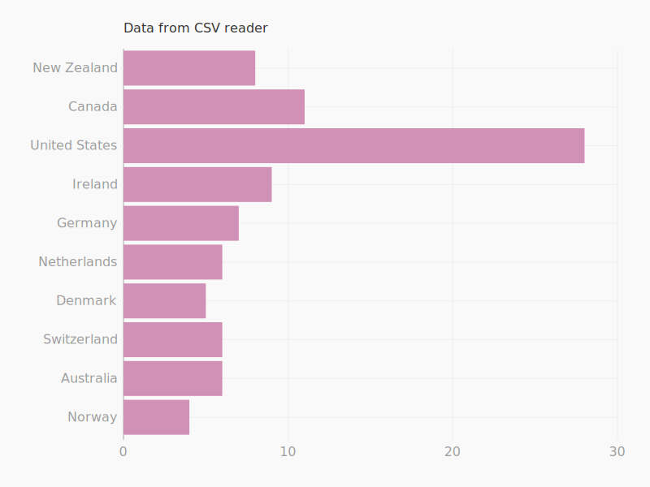
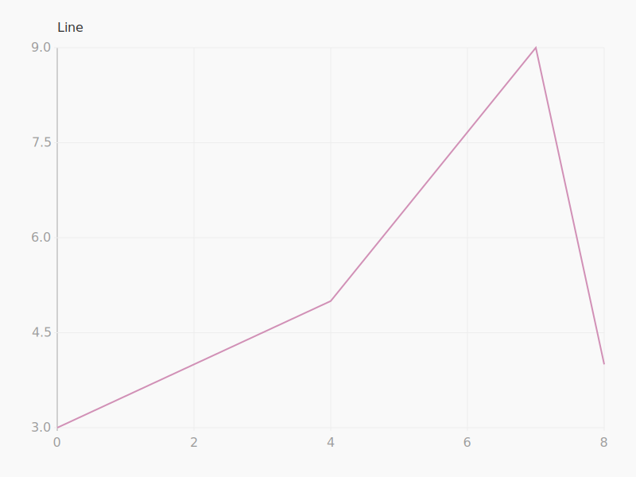
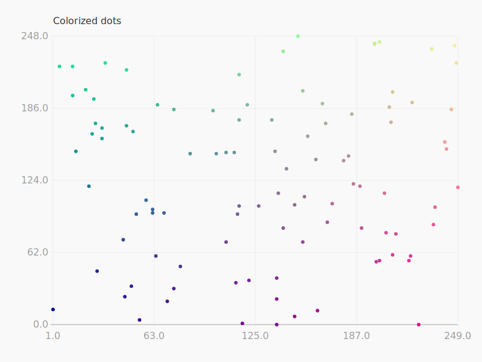

========
Examples
========

Data
====

Simple pairs
------------

.. literalinclude:: ../examples/simple_pairs.py
    :language: python

Table from csv.reader
---------------------

Leather does not automatically convert numerical strings, such as those stored in a CSV. If you want that you'll need to use a smarter table reader, such as `agate <http://agate.rtfd.io/>`_

.. literalinclude:: ../examples/csv_reader.py
    :language: python

Table from csv.DictReader
-------------------------

See previous example for note on strings from CSVs.

.. literalinclude:: ../examples/csv_dict_reader.py
    :language: python

Custom data
-----------

TKTK

Shapes
======

Bars
----

TKTK

Columns
-------

TKTK

Dots
----

TKTK

Lines
-----

.. literalinclude:: ../examples/lines.py
    :language: python

Scales
======

TKTK

Axes
====

TKTK

Styling
=======

TKTK

.. literalinclude:: ../examples/colorized_dots.py
    :language: python

