========
Examples
========

Data series
===========

Simple pairs
------------

.. literalinclude:: ../examples/simple_pairs.py
    :language: python

.. figure:: ../examples/charts/simple_pairs.svg

Table from csv.reader
---------------------

Sequence row data, such as is returned by :func:`csv.reader` can be accessed by specifying the indices of the columns containing the :code:`x` and :code:`y` values.

Note that leather does not automatically convert numerical strings, such as those stored in a CSV. If you want that you'll need to use a smarter table reader, such as `agate <http://agate.rtfd.io/>`_

.. literalinclude:: ../examples/csv_reader.py
    :language: python

.. figure:: ../examples/charts/csv_reader.svg

Table from csv.DictReader
-------------------------

Dict row data, such as is returned by :class:`csv.DictReader` can be accessed by specifying the indices of the columns containing the :code:`x` and :code:`y` values.

See previous example for note on strings from CSVs.

.. literalinclude:: ../examples/csv_dict_reader.py
    :language: python

.. figure:: ../examples/charts/csv_dict_reader.svg

Custom data
-----------

Completely custom data formats are also supported via accessor functions.

.. literalinclude:: ../examples/custom_data.py
    :language: python

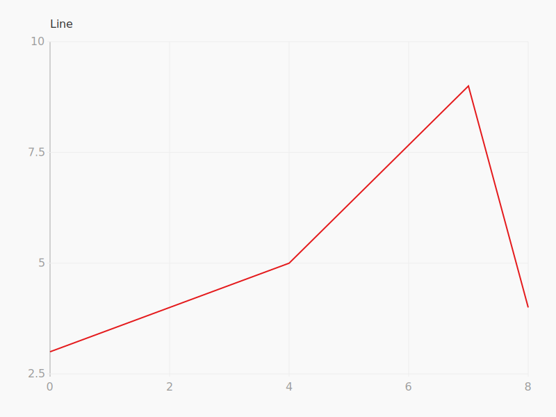

Multiple series
---------------

Multiple data series can be displayed on a single chart so long as they all use the same type of :class:`.Scale`.

.. literalinclude:: ../examples/multiple_series.py
    :language: python

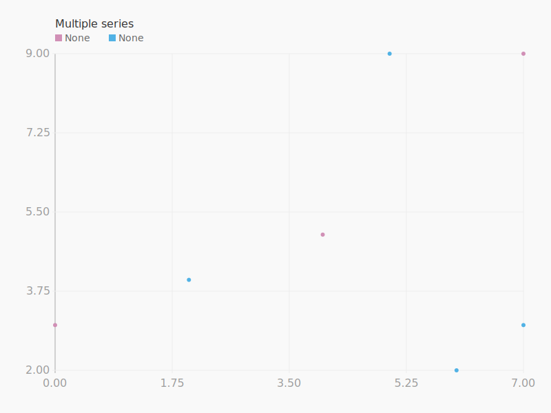

Shapes
======

Bars
----

.. literalinclude:: ../examples/bars.py
    :language: python

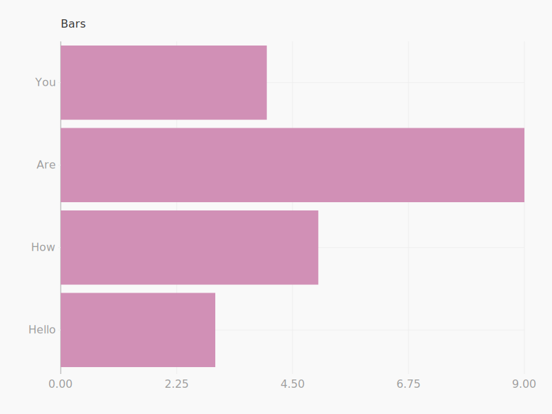

Columns
-------

.. literalinclude:: ../examples/columns.py
    :language: python

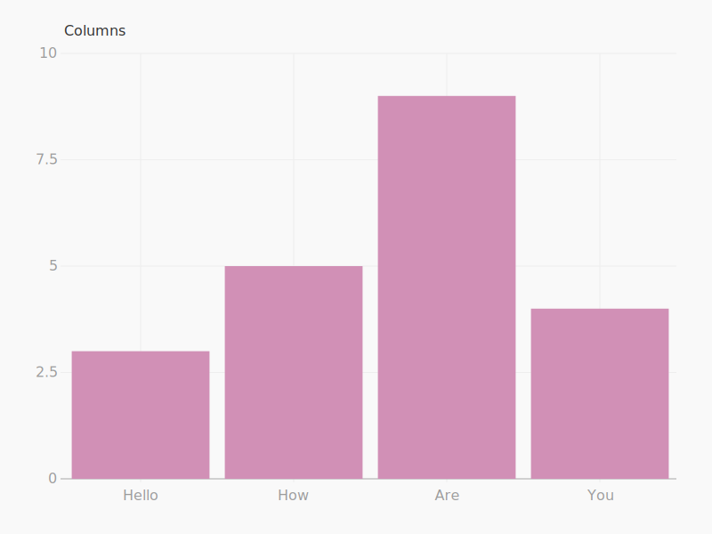

Dots
----

.. literalinclude:: ../examples/dots.py
    :language: python

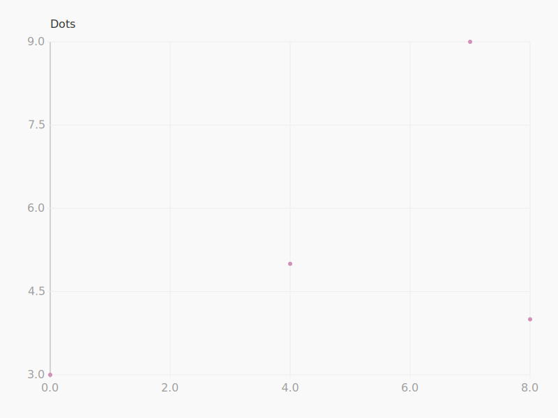

Lines
-----

.. literalinclude:: ../examples/lines.py
    :language: python

.. figure:: ../examples/charts/lines.svg

Mixing shapes
-------------

You can mix different shapes for different series on the same chart.

.. literalinclude:: ../examples/mixed_shapes.py
    :language: python

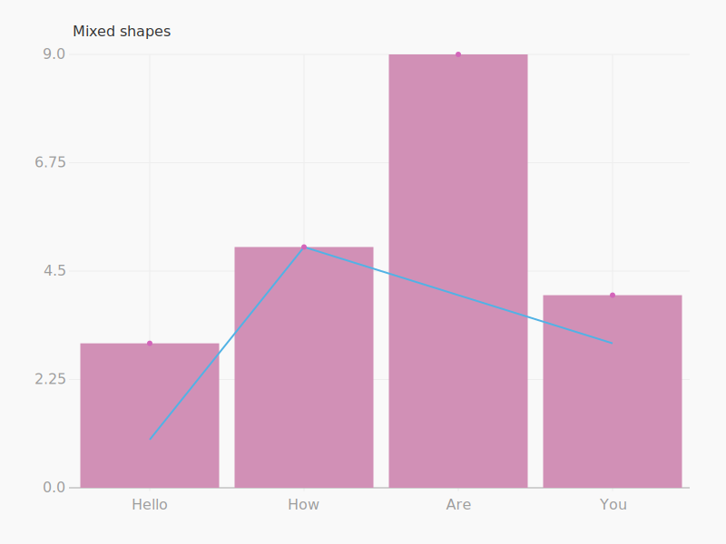

Scales
======

Linear
------

When using numerical data :class:`.Linear` scales are created automatically and by default. You may override the domain by adding a scale manually.

.. literalinclude:: ../examples/linear.py
    :language: python

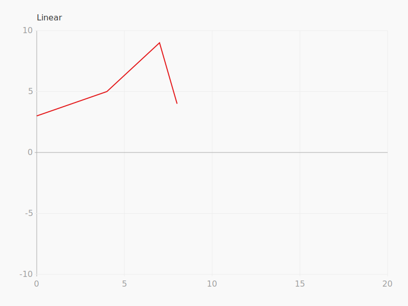

Ordinal
-------

When using text data :class:`.Ordinal` scales are created automatically and by default. It is generally not useful to override these defaults.

.. literalinclude:: ../examples/ordinal.py
    :language: python

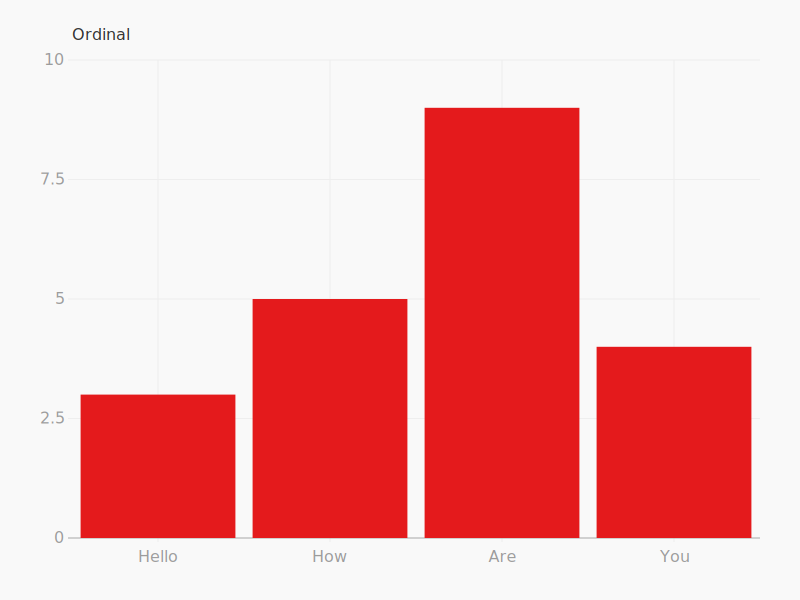

Temporal
--------

When using date/time data :class:`.Temporal` scales are created automatically and by default. You may override the domain by adding a scale manually.

.. literalinclude:: ../examples/temporal.py
    :language: python

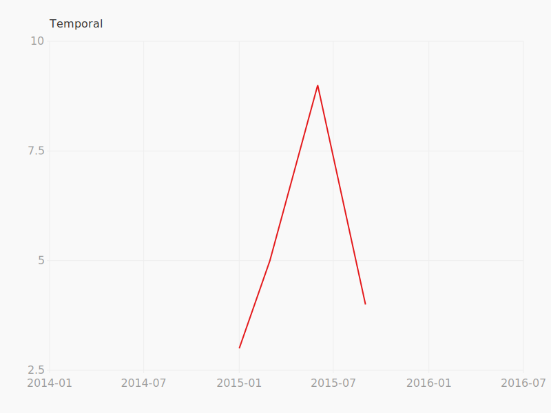

Axes
====

Changing tick values
--------------------

You can change the list of ticks that are displayed using :meth:`.Chart.add_x_axis` and :meth:`.Chart.add_y_axis` methods. This will not adjust automatically adjust the scale, so it is possible to pick tick values that are not displayed.

.. literalinclude:: ../examples/ticks.py
    :language: python

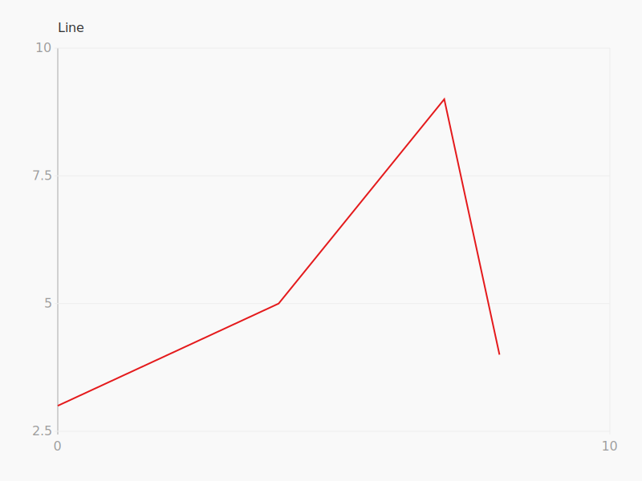

Customizing tick format
-----------------------

You can provide a tick formatter method to change how ticks are displayed using the :meth:`.Chart.add_x_axis` and :meth:`.Chart.add_y_axis` methods.

.. literalinclude:: ../examples/tick_format.py
    :language: python

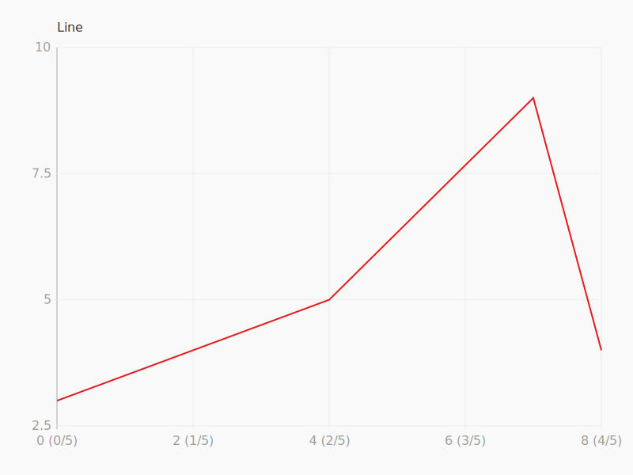

Styling
=======

Changing theme values
---------------------

Chart styles are set using a dead simple :mod:`.theme` system. Leather is meant for making quick and dirty charts. It is neither expected nor recommended for user's to customize these styles.

.. literalinclude:: ../examples/theme.py
    :language: python

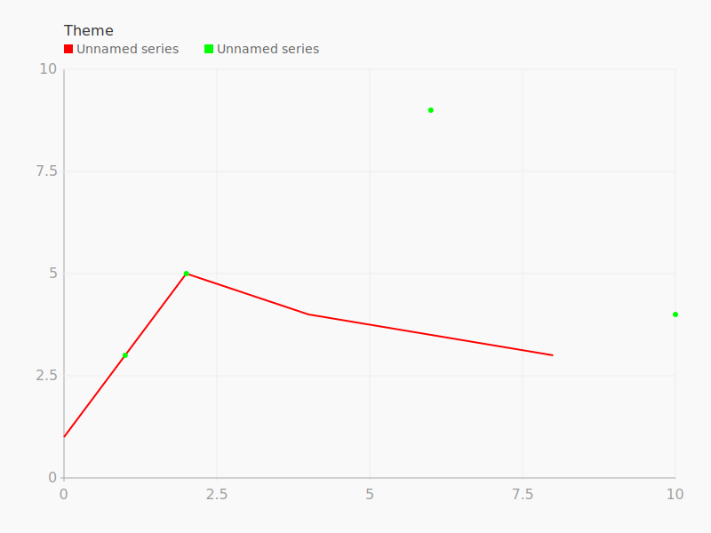

Changing series colors
----------------------

More practically, individual default :class:`.Series` colors can be overridden when they are created.

.. literalinclude:: ../examples/series_color.py
    :language: python

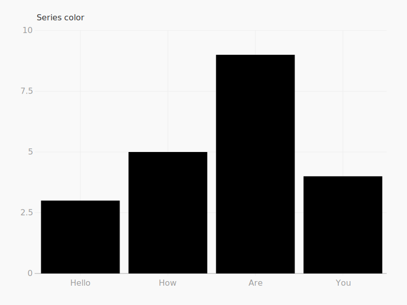

Styling data based on value
---------------------------

Style attributes of individual data points can be set by value using a :func:`.style_function`.

.. literalinclude:: ../examples/colorized_dots.py
    :language: python

.. figure:: ../examples/charts/colorized_dots.svg

Chart grids
===========

With mixed scales
-----------------

You can add charts of completely different types to a single graphic by using :class:`.Grid`.

.. literalinclude:: ../examples/grid.py
    :language: python

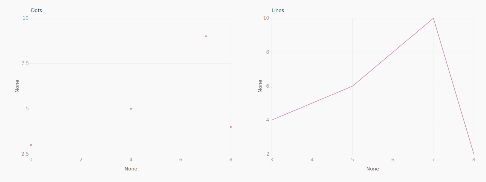

With consistent scales
----------------------

A grid of charts can automatically be synchronized to a consistent view using :class:`.Lattice`.

.. literalinclude:: ../examples/lattice.py
    :language: python

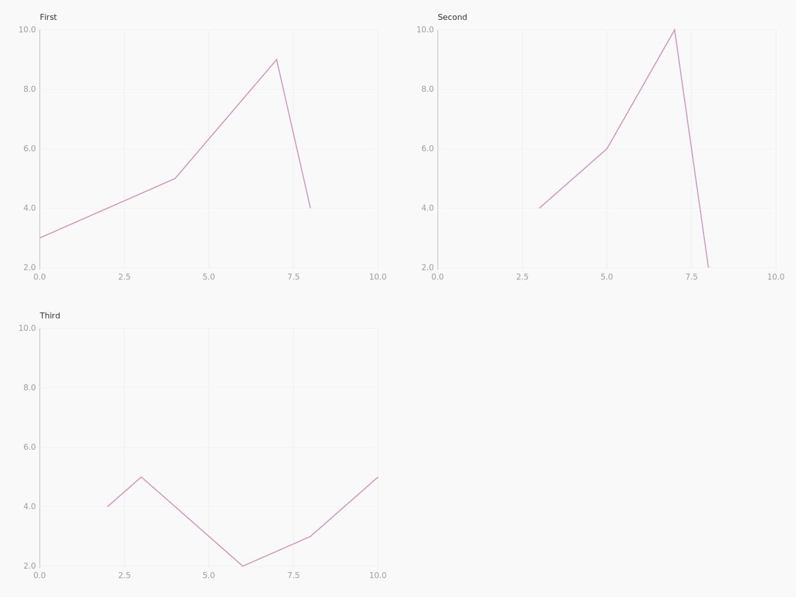
