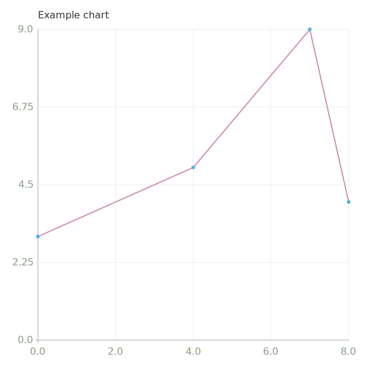

=================
leather |release|
=================

.. include:: ../README.rst

.. toctree::
    :hidden:
    :maxdepth: 2

    about
    install
    api
    release_process
    license

Show me docs
============

* `About <about.html>`_ - why you should use leather and the principles that guide its development
* `Install <install.html>`_ - how to install for users and developers
* `API <api.html>`_ - technical documentation for every agate feature

Show me code
============

.. code-block:: python

    data = [
        (0, 3),
        (4, 5),
        (7, 9),
        (8, 4)
    ]

    chart = leather.Chart()
    chart.add_lines(data)
    chart.add_dots(data)
    chart.to_svg('example.svg')

Join us
=======

* `Release process <release_process.html>`_ - the process for maintainers to publish new releases
* `License <license.html>`_ - a copy of the MIT open source license covering leather

Who we are
==========

.. include:: ../AUTHORS.rst

Indices and tables
==================

* :ref:`genindex`
* :ref:`modindex`
* :ref:`search`
